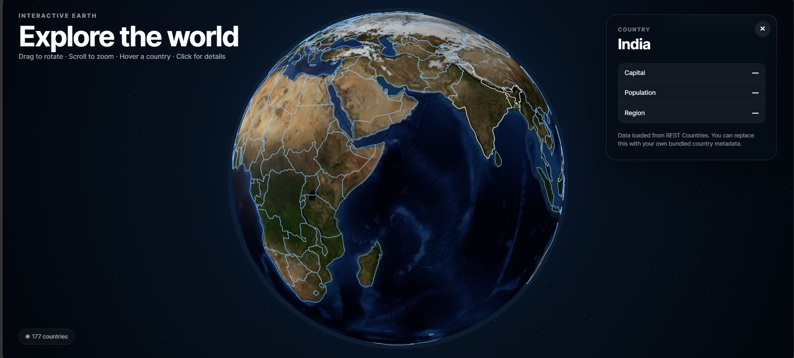

# 3D_Earth
🌍 Interactive 3D Earth Globe

An interactive 3D globe built with React, TypeScript, Three.js, TopoJSON, and d3-geo.

The project displays a textured Earth with country boundaries and allows users to rotate, zoom, hover over countries, and view country information.

✨ Features
🌎 Interactive 3D Earth
🗺️ Country borders based on Natural Earth / World Atlas data
🖱️ Mouse drag to rotate the globe
🔍 Scroll to zoom in and out
📱 Touch-friendly interaction
✨ Country hover highlighting
🏷️ Country name tooltip
🖱️ Click a country to view details
🏳️ Country flag display
🏛️ Capital information
👥 Population information
🌍 Region information
🌐 Country data loaded from the REST Countries API
⭐ Responsive full-screen design
⚡ Optimized Three.js rendering
🛠️ Technologies
React
TypeScript
Three.js
TopoJSON
d3-geo
Vite
REST Countries API

